# AboutFX

An *unofficial GitHub repo* that sum up everything about the JavaFX project state on a single page.

- 🏠 [About the Project](#about-the-project)
- 📚 [Docs and Tutorials](#docs-and-tutorials)
- 🧑‍🤝‍🧑 [Community](#community)
  - [Libraries](#libraries)
  - [Tools](#tools)
  - [Other Languages](#other-languages)
- 📊 [Pulse](#pulse)
  - [Git](#git)
  - [GitHub](#github)
  - [Bug Tracker](#bug-tracker)
  - [Mailing List](#mailing-list)
  - [2022 Recap](#2022)
  - [Latest and Upcoming Features](#latest-features)
- ❓ [FAQ](#faq)
  - [How to start a new project?](#how-to-start-a-new-project)
  - [How to report an issue?](#how-to-report-an-issue)
  - [Where can I find help?](#where-can-i-find-help)
  - [Does JavaFX provide LTS versions?](#does-javafx-provide-lts-versions)
  - [What types of applications can I create with JavaFX?](#what-types-of-applications-can-i-create-with-javafx)

## About the Project

OpenJFX is an open source, next generation client application platform for desktop and embedded systems for use with the JDK. It is a collaborative effort by many individuals and companies with the goal of producing a modern, efficient, and fully featured toolkit for developing rich client applications ([source](https://wiki.openjdk.org/display/OpenJFX/Main)).


- [Official Website](https://openjfx.io/) - the project starting page
- [Project Wiki](https://wiki.openjdk.org/display/OpenJFX/Main) - the project home under umbrella of the OpenJDK
- [Census](https://openjdk.org/census#openjfx) - the list of maintainers

JavaFX follows the same semi-annual [release cadence](https://www.java.com/releases/matrix/) as OpenJDK. A new JavaFX version is being released every *March* and *September*. There're also Early Access builds, that are published every 2-3 weeks.

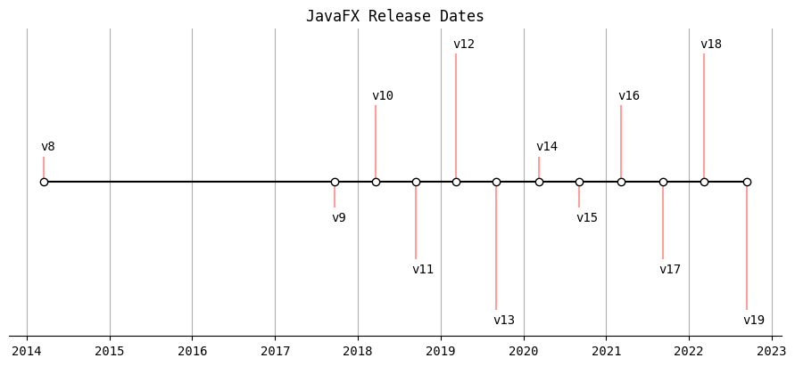

## Docs and Tutorials

Official docs:

- [JavaDoc API Reference](https://openjfx.io/javadoc/19/)
- [CSS Reference](https://openjfx.io/javadoc/19/javafx.graphics/javafx/scene/doc-files/cssref.html)
- [Introduction to FXML](https://openjfx.io/javadoc/19/javafx.fxml/javafx/fxml/doc-files/introduction_to_fxml.html)

Tutorials for beginners:

- [Javatpoint](https://www.javatpoint.com/javafx-tutorial)
- [Jenkov](https://jenkov.com/tutorials/javafx/index.html)
- [ZetCode](https://zetcode.com/gui/javafx)

## Community

[](https://twitter.com/hashtag/JavaFX) [](https://mastodon.social/tags/javafx) [](https://www.reddit.com/r/JavaFX/)

- [JFX Central](https://www.jfx-central.com/home) - one-stop destination for anything related to the JavaFX ecosystem: latest news, a list of people that develop libraries, write books, give presentations
- [FooJay](https://foojay.io/today/category/javafx/) - a place for friends of OpenJDK

### Libraries

| Project              | Tags                 | Description   |
| -------------------- | -------------------- | ------------- |
| [Animated](https://github.com/iAmGio/animated) <br/>  | `#graphics` | Implicit animations for JavaFX inspired by Flutter  |
| [AnimateFX](https://github.com/Typhon0/AnimateFX) <br/>  | `#graphics`  | 70+ ready-to-use animations  |
| [AtlantaFX](https://github.com/mkpaz/atlantafx) <br/>  | `#controls`, `#theme` | Modern CSS theme collection with additional controls  |
| [CalendarFX](https://github.com/dlemmermann/CalendarFX) <br/>  | `#controls`  | A calendar framework containing a set of professional controls to implement a calendar UI  |
| [ChartFx](https://github.com/GSI-CS-CO/chart-fx) <br/>   | `#charts` | A scientific charting library with focus on performance for data sets with up to millions of data point  |
| [ControlsFX](https://github.com/controlsfx/controlsfx) <br/>  | `#controls`, `#layout` | High quality UI controls to complement the core JavaFX distribution |
| [DesktopPaneFX](https://github.com/aalmiray/desktoppanefx) <br/>  | `#controls`, `#graphics`  | JavaFX version of Swing’s `JDesktopPane` which can be used as a container for individual "child" similar to `JInternalFrame` |
| [EasyBind](https://github.com/tobiasdiez/EasyBind) <br/>  | `#base`  | Custom JavaFX bindings made easy with lambdas |
| [Flowless](https://github.com/fxmisc/Flowless) <br/>  | `#controls`  | Efficient `VirtualFlow` which is a layout container that lays out cells in a vertical or horizontal flow, so you may have a list of thousands of items, but only, say, 30 cells are rendered at any given time |
| [FormsFX](https://github.com/dlemmermann/FormsFX) <br/>  | `#framework`  | A framework for easily creating forms |
| [FroXty](https://github.com/iAmGio/froxty) <br/>  | `#graphics`  | A library which replicates the famous iOS translucent effect with ease |
| [FXFileChooser](https://github.com/Oliver-Loeffler/FXFileChooser) <br/>  | `#controls`  | An alternative file chooser for extreme large directories that allows quick manual filtering |
| [FXForm2](https://github.com/dooApp/FXForm2) <br/>  | `#framework`  | A library providing automatic form generation |
| [FXGL](https://github.com/AlmasB/FXGL) <br/>  | `#framework`, `#games`  | Game development engine (framework) |
| [FXGraphics2D](https://github.com/jfree/fxgraphics2d) <br/>  | `#graphics`  | A JavaFX library that allows Java2D code (Graphics2D) to be used to draw to a Canvas node |
| [FXParallax](https://github.com/dukke/FXParallax) <br/>  | `#controls`, `#graphics`  | A controls for adding parallax effects |
| [FXRibbon](https://github.com/dukke/FXRibbon) <br/>  | `#controls`  | Microsoft-like ribbon control |
| [FXTaskbarProgressBar](https://github.com/Dansoftowner/FXTaskbarProgressBar) <br/>  | `#graphics`, `#system`  | A library for showing progress on the Windows taskbar |
| [FXTrayIcon](https://github.com/dustinkredmond/FXTrayIcon) <br/>  | `#graphics`, `system`  | System tray icon implementation that allows developers to use native JavaFX `MenuItem` and not have to worry with AWT or Swing |
| [FXyz](https://github.com/FXyz/FXyz) <br/>  | `#graphics`  | 3D Visualization and Component Library |
| [GemsFX](https://github.com/dlsc-software-consulting-gmbh/GemsFX) <br/>  | `#controls`, `#layout`  | A collection of JavaFX controls and utilities |
| [GestureFX](https://github.com/tom91136/GestureFX) <br/>  | `#controls`, `#graphics`  | A lightweight pinch-to-zoom pane |
| [Gluon Maps](https://github.com/gluonhq/maps) <br/>  | `#controls`  | A library that integrates OpenStreetMaps into a Java application |
| [Gluon Rich Text Area](https://github.com/gluonhq/rich-text-area) <br/>  | `#controls`  | RichTextArea control created with Java and JavaFX standard APIs |
| [Graph Editor](https://github.com/eckig/graph-editor) <br/>  | `#diagrams`, `#framework`  | A library for creating and editing graph-like diagrams |
| [Griffon](https://github.com/griffon/griffon) <br/>  | `#framework`  | Desktop application development platform that leverages concepts like Convention over Configuration, modularity, and freedom of choice |
| [Ikonli](https://github.com/kordamp/ikonli) <br/>  | `#graphics`  | Icon packs for Java applications |
| [JCSG](https://github.com/miho/JCSG) <br/>  | `#graphics`  | Java implementation of BSP based CSG (Constructive Solid Geometry) |
| [JFXtras](https://github.com/JFXtras/jfxtras) <br/>  | `#controls`, `#layout`  | A supporting library containing helper classes, extended layouts and controls |
| [JMetro](https://github.com/JFXtras/jfxtras-styles) <br/>  | `#controls`, `#theme`  | A modern theme inspired by Microsoft Metro |
| [JSilhouette](https://github.com/aalmiray/jsilhouette) <br/>  | `#graphics`  | Additional shapes for Java applications |
| [MaterialFX](https://github.com/palexdev/MaterialFX) <br/>  | `#controls`  | Material design components |
| [Medusa](https://github.com/HanSolo/Medusa) <br/>  | `#controls`, `#charts`  | A library for gauges |
| [MigPane](https://github.com/mikaelgrev/miglayout) <br/>  | `#layout`  | Versatile layout manager |
| [mvvmFX](https://github.com/sialcasa/mvvmFX) <br/>  | `#framework`  | An application framework which provides necessary components to implement the MVVM pattern |
| [Open Lowcode](https://github.com/openlowcode/Open-Lowcode) <br/>  | `#framework`  | A solution for rapid development of specific enterprise software |
| [Orson Charts](https://github.com/jfree/orson-charts) <br/>  | `#charts`  | An interactive 3D chart library |
| [PreferencesFX](https://github.com/dlemmermann/PreferencesFX) <br/>  | `#framework`  | A library to easily create a UI for application settings / preferences |
| [ReactiveDeskFX](https://github.com/TangoraBox/ReactiveDeskFX) <br/>  | `#framework`  | A micro-framework to develop JavaFX components very fast and with minimal code following MVVM architecture pattern with passive view |
| [RichTextFX](https://github.com/fxmisc/RichTextFX) <br/>  | `#controls`  | A memory-efficient text area that allows to style ranges of text and display custom objects in-line |
| [TestFX](https://github.com/TestFX/TestFX) <br/>  | `#unit-tests`  | Simple and clean testing for JavaFX |
| [TilesFX](https://github.com/HanSolo/tilesfx) <br/>  | `#controls`, `#charts`  | A library containing tiles that can be used for dashboards |
| [TiwulFX Dock](https://github.com/panemu/tiwulfx-dock]) <br/>  | `#controls`  | Enhanced `TabPane` that supports tab reordering, detaching and docking |
| [UndoFX](https://github.com/fxmisc/UndoFX) <br/>  | `#base`  | A general-purpose undo manager |
| [ValidatorFX](https://github.com/effad/ValidatorFX) <br/>  | `#framework`  | A form validation library |
| [VWorkflows](https://github.com/miho/VWorkflows) <br/>  | `#diagrams`  | Interactive flow/graph visualization for building domain specific visual programming environments |
| [WorkbenchFX](https://github.com/dlemmermann/WorkbenchFX) <br/>  | `#framework`  | A lightweight RCP framework |

### Tools

| Project              | Tags                 | Description   |
| -------------------- | -------------------- | ------------- |
| [Component-Inspector](https://github.com/TangoraBox/ComponentInspector) <br/>  | `#dev-tools` |  A tool to help to inspect the location and properties of a component in a window hierarchy |
| [Conveyor](https://github.com/hydraulic-software/conveyor) <br/>  | `#deployment` |  A tool that generates self-upgrading packages for Windows, macOS and Linux using each platform's native package formats without requiring you to have those operating systems |
| [CssFX](https://github.com/McFoggy/cssfx) <br/>  | `#dev-tools` | A tool that provides CSS reloading functionality in a running application (hot reload)  |
| [FXLauncher](https://github.com/edvin/fxlauncher) <br/>  | `#deployment` | Auto-updating launcher for JavaFX applications |
| [Getdown](https://github.com/threerings/getdown) <br/>  | `#deployment` | A system for deploying Java applications to end-user computers, as well as keeping those applications up to date |
|  [Gluon Scene Builder](https://github.com/gluonhq/scenebuilder) <br/>  | `#dev-tools` | A drag and drop UI designer tool allowing rapid desktop and mobile app development |
|  [JavaFX Gradle Plugin](https://github.com/openjfx/javafx-gradle-plugin) <br/>  | `#build`, `#gradle` | Simplifies working with JavaFX 11+ for gradle projects |
|  [JavaFX Maven Plugin](https://github.com/openjfx/javafx-maven-plugin) <br/>  | `#build`, `#maven` | Maven plugin to run JavaFX 11+ applications |
|  [Maven JPackage Template](https://github.com/wiverson/maven-jpackage-template) <br/>  | `#build`, `#template` | A sample project illustrating building nice, small cross-platform JavaFX or Swing desktop apps with native installers with GitHub Actions included |
|  [SASS CLI Maven Plugin](https://github.com/HebiRobotics/sass-cli-maven-plugin) <br/>  | `#build`, `#maven` | A thin wrapper around the [SASS](https://sass-lang.com/dart-sass) command line interface for generating CSS files, so you can use CSS preprocessor to create your stylesheets with comfort |
|  [Scenic View](https://github.com/JonathanGiles/scenic-view) <br/>  | `#dev-tools` | An application designed to make it simple to understand the current state of application scene-graph, and to also easily manipulate properties of the scene-graph without having to keep editing the code |
|  [Update4j](https://github.com/update4j/update4j) <br/>  | `#deployment` | Auto-updater and launcher built with Java 9 module system in mind. |
|  [WebFX](https://github.com/webfx-project/webfx) <br/>  | `#transpiler` | Write your Web Application in JavaFX and WebFX will transpile it in pure JS |

### Other Languages

- [Cljfx](https://github.com/cljfx/cljfx) (Closure) 
- [ScalaFX](https://github.com/scalafx/scalafx) (Scala) 
- [TornadoFX](https://github.com/edvin/tornadofx) (Kotlin) 

## Pulse

JavaFX [has a long history](https://en.wikipedia.org/wiki/JavaFX). The project started at 2009 and was a part of Oracle JDK until 2018. With the release of OpenJDK 11, Oracle made JavaFX part of the OpenJDK under the OpenJFX project, in order to increase the pace of its development. From the following charts you can form an opinion whether it's worked or not.

### Git

The number of committers no changed much since the JavaFX8 release in 2014, and the number of commits is more or less stable since the initial development stage is finished.

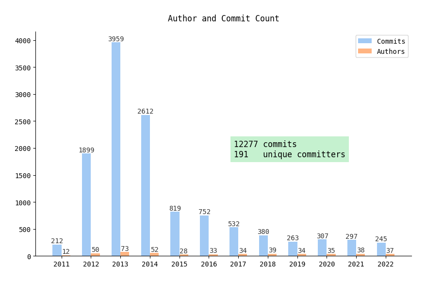

Not very useful, but nonetheless below graphs can give an idea about the project complexity.

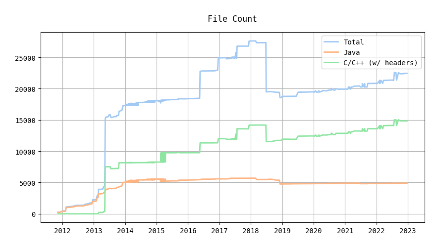
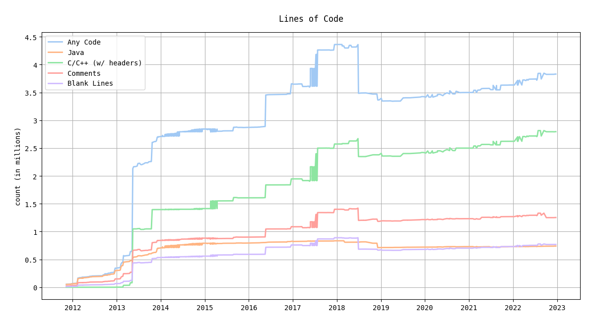

### Github

[OpenJFX](https://github.com/openjdk/jfx) was officially published on Github in 2019 as a part of [Project Scara](https://github.com/openjdk/skara) ([JEP 369](https://openjdk.org/jeps/369)) and there was Gluon's [javafxports](https://github.com/javafxports/openjdk-jfx) initiative prior to that.

So, we can investigate how the project popularity on GitHub increased since then.

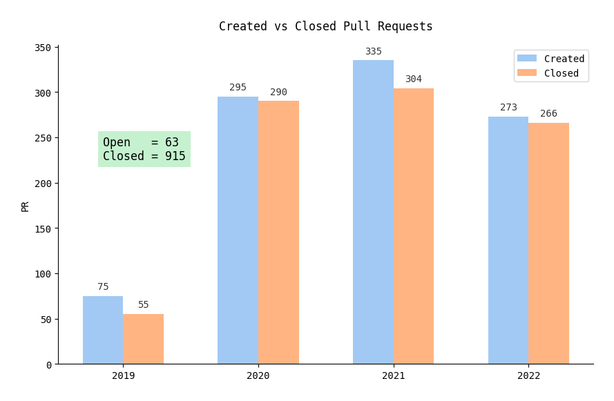
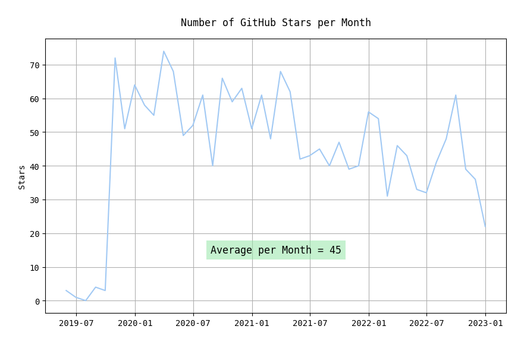

The number of created JavaFX projects is vague, but still interesting metric. As you can see it's almost stable.

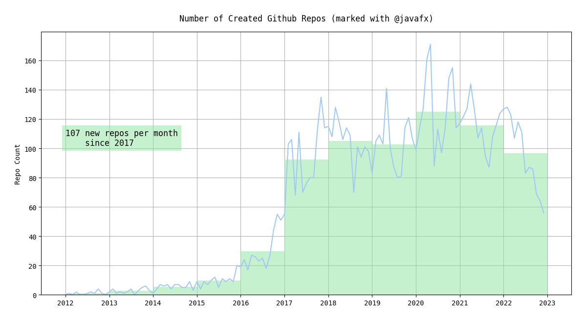

### Bug Tracker

JavaFX uses OpenJDK bug tracker, namely [Java Bug System](https://bugs.openjdk.org/secure/Dashboard.jspa). Let's check some summary for starters.

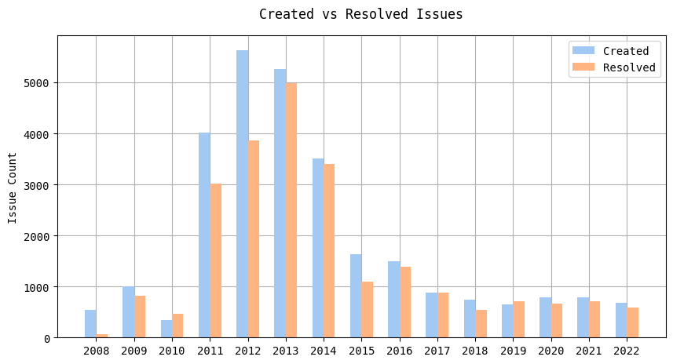

<table cellspacing="0" cellpadding="0">
  <tr>
    <td>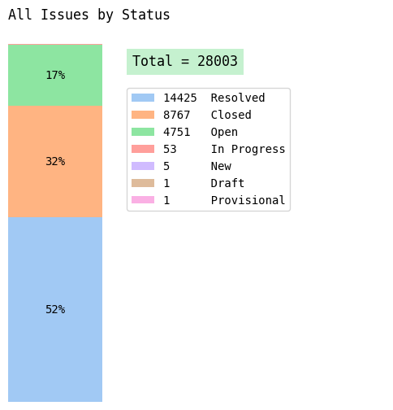</td>
    <td>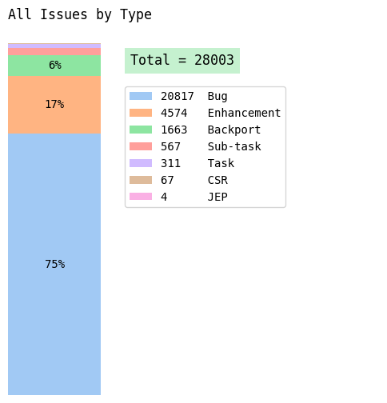</td>
  </tr>
  <tr>
    <td>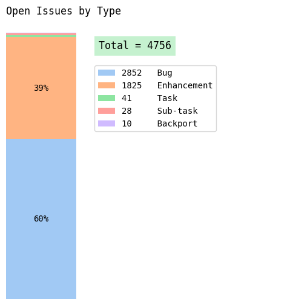</td>
    <td>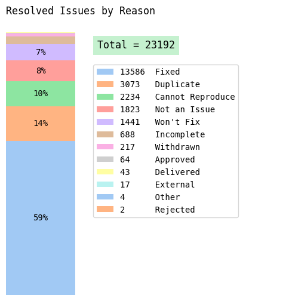</td>
  </tr>
</table>

Now that's more interesting, the number of resolved issues by version. Unsurprisingly, LTS versions in leaders because they're still receive a backports.


Also, as expected most of the issues are addressed to the `javafx-controls` module.

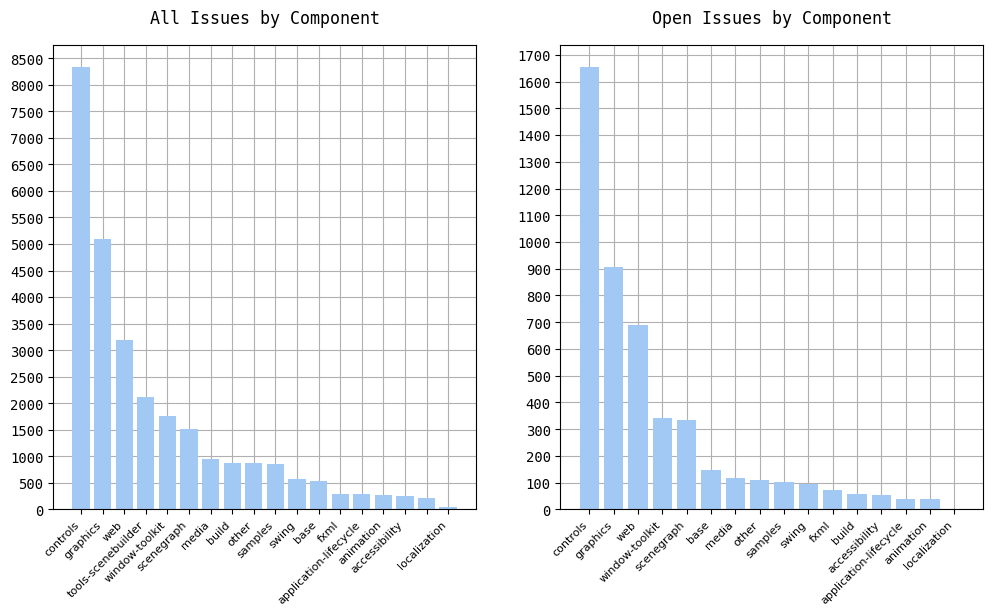

And finally to answer a question how old most of the issues are. Note that most of them isn't critical. It can be a small enhancements, like providing more reliable tests here and there, but since JBS is locked to committers only, so regular users can't vote, there won't be more detailed stats.

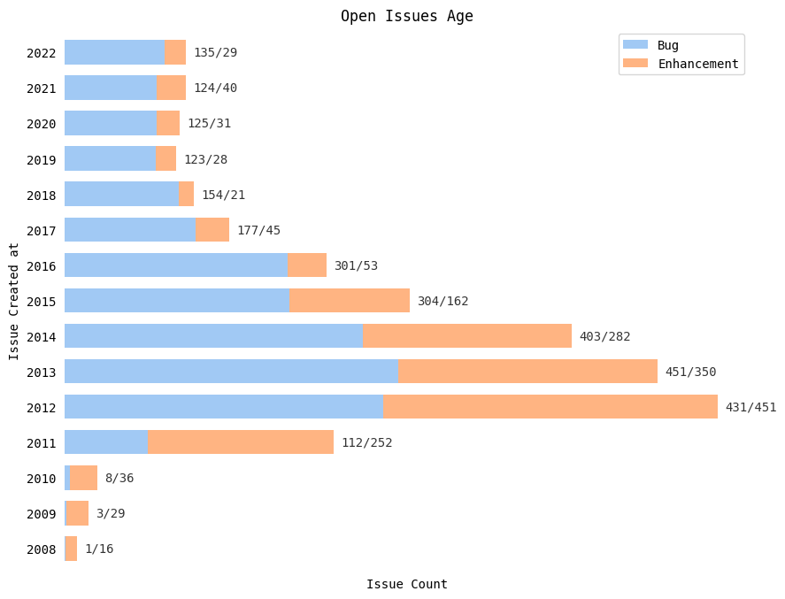

### Mailing List

The stats from the [OpenJFX Dev mailing list](https://mail.openjdk.org/mailman/listinfo/openjfx-dev). There's also [OpenJFX Discuss mailing list](https://mail.openjdk.org/mailman/listinfo/openjfx-discuss), but it's long dead, because people mostly prefer StackOverflow or Reddit these days.

As you can see, mailing list activity increased three times after the OpenJFX was published on GitHub.

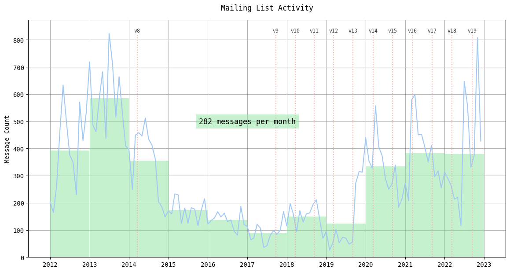

### 2022

[OpenJFX 18](https://github.com/openjdk/jfx/blob/master/doc-files/release-notes-18.md) (March) and [OpenJFX 19](https://github.com/openjdk/jfx/blob/master/doc-files/release-notes-19.md) (September) released.

And just some stats to show that the project development is still quite active.

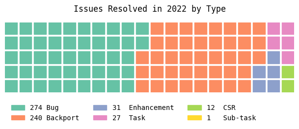

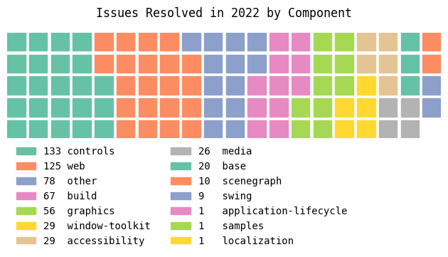

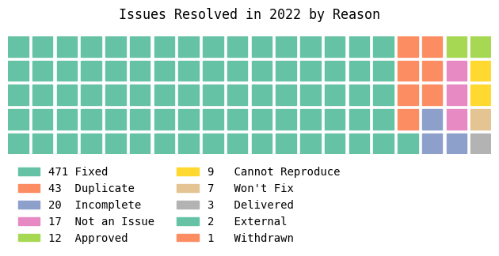

### Latest Features

This is an excerpt of the most interesting recent features from the JavaFX **[release notes](https://github.com/openjdk/jfx/tree/master/doc-files)** and the list of **[pull requests](https://github.com/openjdk/jfx/pulls)**.

- `(JFX17)` [Loading stylesheets from data-URIs](https://github.com/openjdk/jfx/pull/536)
  Adds support for the data-URI scheme to load stylesheets embedded into code or FXML files. This can be useful for small applications that would otherwise need to deploy their stylesheets alongside the application. It can also be useful to dynamically generate and add stylesheets to applications without deploying temporary files on disk. Usage example:
  ```java
  node.getStylesheets().add("data:base64," + new String(Base64.getEncoder().encode(YOUR_CSS.getBytes()), UTF_8));
  ```
- `(JFX17)` [Loading images from inline data-URIs](https://github.com/openjdk/jfx/pull/508)
  Adds support for loading images from inline data URIs, which is also widely supported by web browsers. This enables developers to package small images directly in CSS files, rather than separately deploying the images alongside the CSS file. Usage example:
  ```css
  .foo {
      -fx-background-image: url("data:image/png;base64,BASE64_STRING");
  }
  ```
- `(JFX17)` [API to query states of CAPS LOCK and NUM LOCK keys](https://github.com/openjdk/jfx/pull/385)
    Being able to read the lock state would allow an application to inform the user that caps lock was enabled for passwords or other usages where the keyboard input might not be echoed. It would also allow an application to do spell checking / auto-correction that might ordinarily be skipped when typing all upper-case letters. Usage example: simply check the new `Platform#isKeyLocked(KeyCode)` method.
- `(JFX18)` [CSS-styleable Node.managed property](https://github.com/openjdk/jfx/pull/602)
   A common design pattern is to not only make objects invisible, but also let other components use the freed space. With JavaFX this can be achieved by modifying CSS using node `{ visible: false; -fx-min-width: 0; -fx-pref-width: 0; }`. From now on, it can be done simpler by node `{ visible: false; -fx-managed: false; }`.
- `(JFX18)` [Transparent backgrounds in WebView](https://github.com/openjdk/jfx/pull/563)
    Allows a `WebView` to be created with a transparent background, so that HTML content can be rendered over something else.
- `(JFX19)` [:focus-visible and :focus-within CSS pseudo-classes](https://bugs.openjdk.org/browse/JDK-8268225)
   The W3C CSS Selectors Level 4 specification defines three focus-related pseudo-classes: "focus", which applies to a node that currently accepts keyboard or mouse input; ["focus-visible"](https://developer.mozilla.org/en-US/docs/Web/CSS/:focus-visible), which applies to a focused node that visibly indicates focus, and ["focus-within"](https://developer.mozilla.org/en-US/docs/Web/CSS/:focus-within), which applies to a focused node and any of its parents. Check MDN examples to understand how it works.
- `(JFX19)` [Map, FlatMap and OrElse fluent bindings for ObservableValue](https://github.com/openjdk/jfx/pull/675).
  Adds support for creating derived bindings directly from ObservableValue with new API in the ObservableValue interface. Check PR for more examples.
  ```java
  // Standard JavaFX:
  label.textProperty().bind(text.length().negate().add(100).asString().concat(" characters left"));
  // Fluent: more compact and more clear
  label.textProperty().bind(text.orElse("").map(v -> 100 - v.length() + " characters left"));
  ```

#### Upcoming

- (**integrated**) [Simplified deterministic way to manage listeners](https://github.com/openjdk/jfx/pull/830)
  Adds a new property on `Node` which provides a boolean which indicates whether or not the `Node` is currently a part of a `Scene`. It also adds a new fluent binding method `when()` on `ObservableValue`. Now it becomes easier to break strong references that prevent garbage collection between a long lived property and one that should be shorter lived.
  ```java
  // the label is eligible for GC immediately after it stops showing as the listener
  // on longLivedProperty is removed when the provided condition is false
  label.textProperty().bind(longLivedProperty.when(label::isShowingProperty))
  ```
- [CSS themes as a first-class concept](https://github.com/openjdk/jfx/pull/511)
  The new theming API in `javafx.graphics` that provides a basic framework to support application-wide style themes. Usage example:
  ```java
  Application.setStyleTheme(() -> List.of("stylesheet1.css", "stylesheet2.css");
  // or
  Application.setStyleTheme(new ModenaTheme() {{
        addFirst("stylesheet1.css");
        addLast("stylesheet2.css");
  }});
  ```
- [Additional constrained resize policies for Tree/TableView](https://github.com/openjdk/jfx/pull/897)
  Replaces old column resize algorithm with a different one, which not only honors all the constraints when resizing, but also provides 4 different resize modes similar to JTable: `AUTO_RESIZE_NEXT_COLUMN`,`AUTO_RESIZE_SUBSEQUENT_COLUMNS`, `AUTO_RESIZE_LAST_COLUMN`, `AUTO_RESIZE_ALL_COLUMNS`.

#### Drafts

- [Undecorated interactive stage style](https://github.com/openjdk/jfx/pull/594)
  Making undecorated windows resizable is very painful. There're [number of implementations](https://stackoverflow.com/questions/19455059/allow-user-to-resize-an-undecorated-stage) and none of them work good. The PR introduces `StageStyle.UNDECORATED_INTERACTIVE` which is similar to `StageStyle.UNDECORATED`, but adds platform-specific interactions to the window. For all platforms, this includes move and resize behaviors. On Windows, it also includes Aero behaviors (snap to screen edges, dock at top to maximize, etc.).
- [CSS transitions](https://github.com/openjdk/jfx/pull/870)
  Introduces CSS transitions, which specify how a property changes its value smoothly from one value to another.
  ```css
  .button {
    -fx-background-color: dodgerblue;
  }
  .button:hover {
    -fx-background-color: red;
    -fx-scale-x: 1.1;
    -fx-scale-y: 1.1;

    transition: -fx-background-color 0.5s ease,
                -fx-scale-x 0.5s ease,
                -fx-scale-y 0.5s ease;
  }
  ```

## FAQ

#### How to start a new project?

There are [detailed instructions]((https://openjfx.io/openjfx-docs/)) on the OpenJFX website and also a convenient [Gluon Start](https://start.gluon.io/) project generator. If you're in Maven, check [Maven JPackage Template](https://github.com/wiverson/maven-jpackage-template), which gives you ready-to-use GitHub project.

#### How to report an issue?

JavaFX uses OpenJDK JIRA bug tracker, so you have to [report issues there](https://bugreport.java.com/bugreport). Sadly, *Java Bug System* is read-only for ordinary users, so you won't be able neither to participate in discussion nor to provide additional info after reporting.

#### Where can I find help?

- [StackOverflow](https://stackoverflow.com/questions/tagged/javafx) with `javafx` tag.
- [JavaFX](https://www.reddit.com/r/JavaFX) or [JavaHelp](https://www.reddit.com/r/javahelp) Reddit communities.
- [OpenJFX Dev mailing list](https://mail.openjdk.org/mailman/listinfo/openjfx-dev) for discussions.

#### Does JavaFX provide LTS versions?

Yes. Gluon, which is one of the largest OpenJFX contributors, provides [LTS builds](https://gluonhq.com/products/javafx/) for free, but there's also extended commercial support.

#### What types of applications can I create with JavaFX?

Almost everything. [Complex](https://pdfsam.org) [desktop](https://renatoathaydes.github.io/LogFX) [apps](https://github.com/gleidsonmt/DashboardFx), [multimedia](https://github.com/goxr3plus/XR3Player), [games](https://github.com/BhavyaC16/Plants-Vs-Zombies), [mobile](https://gluonhq.com/products/mobile/) and [Web](https://www.jpro.one) [too](https://webfx.dev).

#### JavaFX is not a part of JDK anymore. Does it mean the project is abandoned?

No, it doesn't. [Haven't you seen the charts?](#pulse) Critical bugs are fixed very fast and there was a number of good features since JDK 11. JavaFX [is a part of OpenJDK project](https://wiki.openjdk.org/display/OpenJFX/Main) and while some major OpenJDK providers compile JDK with JavaFX included ([Azul Zulu](https://www.azul.com/downloads/?package=jdk-fx), [BellSoft Liberica](https://bell-sw.com/pages/downloads/) [and Oracle since 20EA](https://jdk.java.net/javafx20/)) it *is* a part of OpenJDK distribution as well.
